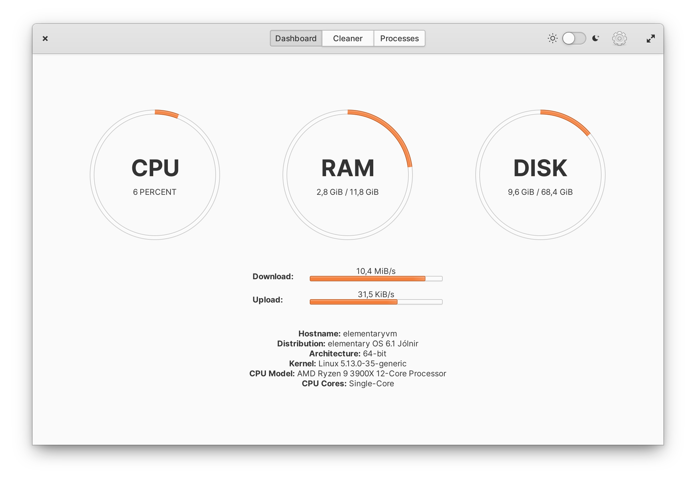

# Optimizer

[](https://github.com/hannesschulze/optimizer/actions/workflows/ci.yml)
[](COPYING)
[](https://github.com/hannesschulze/optimizer/releases)

> Find out what's eating up your system resources and delete unnecessary files from your disk.

## Current State Of The Project

> ⚠️ This project is currently unmaintained. It is still possible to install Optimizer manually on the elementary OS (tested on elementary OS 6.1). For more information, see [#93 (comment)](https://github.com/hannesschulze/optimizer/issues/93#issuecomment-1072797314).



## Installation instructions

### Dependencies

These dependencies must be present before building:
 - `meson`
 - `valac`
 - `debhelper`
 - `libgranite-dev`
 - `libgtk-3-dev`
 - `libgtop2-dev`
 - `libwnck-3-dev`

Use the following command to install the dependencies on elementary OS:

```shell
sudo apt install elementary-sdk libgtop2-dev libwnck-3-dev
```
 
Use the following command to install the dependencies on other Debian-based systems:

```shell
sudo apt install meson valac appstream-util libgranite-dev libgtop2-dev libwnck-3-dev
```
 
### Building

```
git clone https://github.com/hannesschulze/optimizer.git && cd optimizer
meson build --prefix=/usr
cd build
ninja
```

To install, use `ninja install`, then execute with `com.github.hannesschulze.optimizer`:

```shell
sudo ninja install
com.github.hannesschulze.optimizer
```

### Using the fallback theme

If you don't use elementary OS, the CPU-, memory- and disk-usage view styles might look out of place. If this is the case, recompile Optimizer using the following commands (still in the build directory) to enable a flat style:

```shell
meson configure -Duse_fallback_theme=true
ninja
```

After recompiling the app, Optimizer also needs to be reinstalled (see "Building").

### Credits

- **Stacer:** This project is heavily inspired by [Stacer](https://oguzhaninan.github.io/Stacer-Web/) (written in Qt). Optimizer aims to provide some of the features in an elementary app with native Gtk widgets.
- **Monitor:** Some of the logic for the process list is from [Monitor](https://github.com/stsdc/monitor), which is another elementary app. Optimizer is using some of the code in a simplified version - other than Monitor it just uses a process list instead of a neat tree view. Definitely check out this project if you want a monitor!

### License

This project is licensed under the GPL-3.0 License - see the [COPYING](COPYING) file for details.
